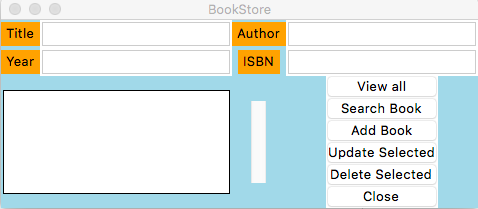
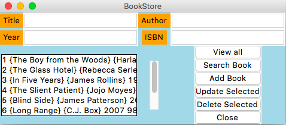
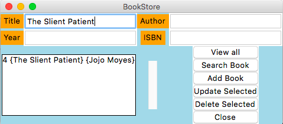
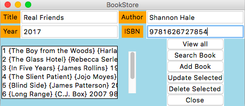
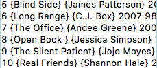
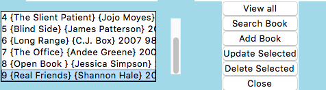
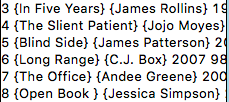

# Bookstore-Application
This application stores name, author, year, and isbn number of books in database. Users interacte with a GUI to view all books, search a book, add a book, update and delete a book.

## Getting Started
This application was created through Visual Studio Code using tkinter GUI library and SQLite3 library to interact with SQLite database.

To run the program, download books.db, backend.py, and Bookstore.py. 

## Installation
Install tkinter: ```pip3 install tkinter```

Install sqlite3: ```pip3 install sqlite3```

You should be able to run the program on your enviornment

## Program
The application was built using tkinter grid system. It contains fields for Title, Author, Year, ISBN to enter information about a book. The Area box displays all the books, or a selected book. The application contains various to perform certain actions.



The database has eight default books. To view them, or to view any new book you add, click view button. It shows all the books that are currently in books.db



You can search a book by simplying writing the name of the book on Title field. If there are multiple books with same name, the application will all the books that match the name of the book entered



To add a book, enter all the fields and click "Add book". This will create a new entry on books.db and you can view the new book you added on the application.





To delete a book, select a book from the application and click "Delete book". This will remove that book entry from the books.db and you can view this change on the application






